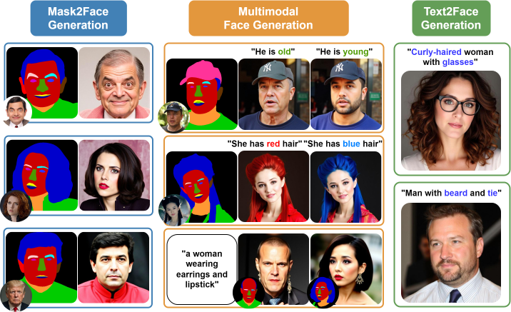
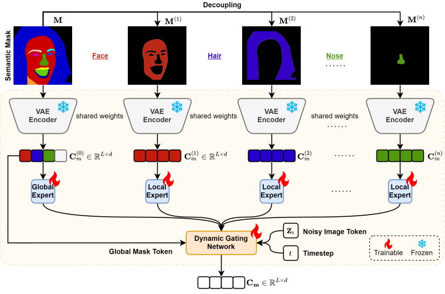
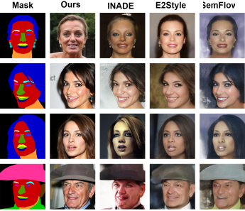
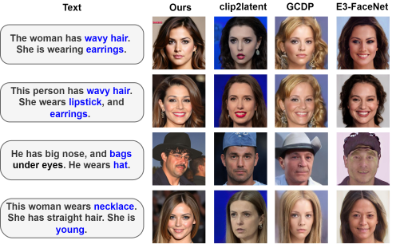
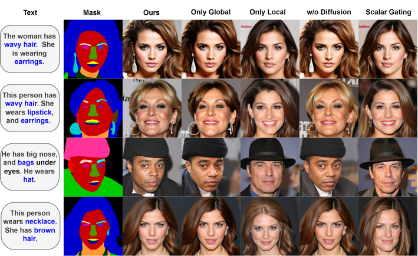
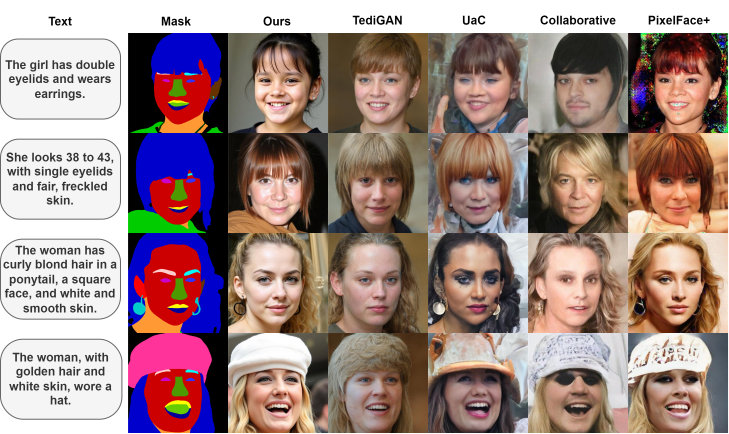

<div align="center">


# Face-MoGLE

Mixture of Global and Local Experts with Diffusion Transformer for Controllable Face Generation



</div>

<!--This repository serves as the official implementation of the paper **"Mixture of Global and Local Experts with Diffusion Transformer for Controllable Face Generation"**. It provides a comprehensive pipeline for semantic segmentation, including data preprocessing, model training, evaluation, and deployment, specifically tailored for cloud segmentation tasks in remote sensing imagery.-->

---

<!-- ## Features

**Face-MoGLE** is a novel and flexible framework for high-quality, controllable face generation, built on top of Diffusion Transformer (DiT) models.

* **Global-Local Expert Mixture 🧠**: Incorporates a Mixture of Experts (MoE) with both global and local experts to simultaneously capture holistic facial structure and fine-grained regional details.

* **Decoupled Semantic Control 🎛️**: Semantic masks are disentangled from the diffusion process, enabling fine-grained control over facial attributes without sacrificing image quality.

* **Dynamic Expert Routing 🔄**: A spatially-aware gating network dynamically adjusts expert contributions during the diffusion process, allowing adaptive semantic alignment and visual fidelity.

* **Photorealism with Robustness 📸**: Generated faces are highly photorealistic and can fool state-of-the-art face forgery detectors, making the method valuable for both creative and security-related applications.

* **Multimodal & Zero-Shot Generalization 🌈**: Works effectively under both multimodal and monomodal conditions with strong zero-shot generalization across diverse face generation tasks.

---

## News

- **2025-04-11**: 🧪 Inference and demo scripts released! Try Face-MoGLE with your own semantic masks and test its control capability across different face attributes. 

 -->

## Installation

```bash
conda create -n face-mogle python=3.11.11
conda activate face-mogle
pip install -r requirements.txt
```

## Prepare Dataset

```bash  
Face-MoGLE
├── ...
├── data
│   ├── mmcelebahq
│   │   ├── face
│   │   │   ├── 0.jpg
│   │   │   ├── 1.jpg
│   │   ├── mask
│   │   │   ├── 0.png
│   │   │   ├── 1.png
│   │   ├── text
│   │   │   ├── 0.txt
│   │   │   ├── 1.txt
│   │   ├── text.json
│   ├── mmffhqfemale
│   │   ├── face
│   │   │   ├── 0.jpg
│   │   │   ├── 1.jpg
│   │   ├── mask
│   │   │   ├── 0.png
│   │   │   ├── 1.png
│   │   ├── text
│   │   │   ├── 0.txt
│   │   │   ├── 1.txt
│   │   ├── text.json
```   

<br>

## 🚀 Training

Train Face-MoGLE with default configuration:

```bash
bash script/train_face-mogle.sh
```

---

## 🧪 Testing

Run test script:

```bash
python test.py \
  --root data/mmcelebahq \
  --lora_ckpt runs/face-mogle/pytorch_lora_weights.safetensors \
  --moe_ckpt runs/face-mogle/mogle.pt \
  --pretrained_ckpt checkpoints/FLUX.1-dev \
  --config_path runs/face-mogle/config.yaml \
  --output_dir visualization/face-mogle

```

---

## 📊 Evaluation

Face-MoGLE is evaluated across multiple dimensions, including visual fidelity, semantic alignment, and structural consistency.

---

### 🎯 FID / KID / Text Consistency  
Measure generation quality and text-image alignment.

- 📌 **[FID & KID](https://github.com/GaParmar/clean-fid)**
- ✍️ **[Text Consistency](https://github.com/Taited/clip-score)**

```bash
python src/eval/eval_fid_kid_text.py \
    --fake_image visulization/face-mogle/face \
    --real_face_dir visulization/mmcelebahq/face \
    --real_text_dir visulization/mmcelebahq/text \
    --output_dir eval_result
```

---

### 🧠 CLIP Maximum Mean Discrepancy (CMMD)  

- 🤖 **[CMMD](https://github.com/sayakpaul/cmmd-pytorch)**

```bash
cd cmmd-pytorch
python main.py gt_dir pred_dir
```

---

### 🎭 Mask Consistency (DINO Structure Distance)  

- 🧩 **[Mask Consistency](https://github.com/omerbt/Splice)**

```bash
python src/eval/eval_mask.py \
    --real_dir visulization/mmcelebahq/face \
    --fake_img visulization/face-mogle/face \
    --output_dir eval_result
```

---

### 👤 Human Perference (ImageReward)  

- 🌟 **[ImageReward (IR)](https://github.com/THUDM/ImageReward)**

```bash
python src/eval/eval_ir.py \
    --image_path visulization/face-mogle/face \
    --text_path visulization/mmcelebahq/text \
    --output_dir eval_result
```

---

## 🖼️ Inference

Generate images with semantic mask + text:

```bash
python inference.py \
    --prompt "She is wearing lipstick. She is attractive and has straight hair." \
    --mask "data/mmcelebahq/mask/27000.png" \
    --output_dir output
```

---

## 🌐 Gradio Demo (Web UI)

Launch the interactive demo app:

```bash
python gradio_app.py
```


<br>

## Visual Results

### 🔹 Monomodal Generation

<table>
  <tr>
    <td align="center"><b>Mask-to-Face Generation</b></td>
    <td align="center"><b>Text-to-Face Generation</b></td>
  </tr>
  <tr>
    <td></td>
    <td></td>
  </tr>
</table>

### 🔸 Multimodal Generation

<p align="center">
  
</p>

---

### 🔬 Ablation Study

<p align="center">
  
</p>

---

### 🧪 Zero-Shot Generalization (MM-FFHQ-Female)

<p align="center">
  
</p>


<!-- <br> -->

<!-- ## Citation


```bibtex
@article{Face-MoGLE,
  title     = {Mixture of Global and Local Experts with Diffusion Transformer for Controllable Face Generation},
  author    = {Your Name and Coauthors},
  journal   = {arXiv preprint arXiv:xxxx.xxxxx},
  year      = {2025}
}
``` -->

---

## License

This project is licensed under the Apache License 2.0 License. See the [LICENSE](LICENSE) file for details.
