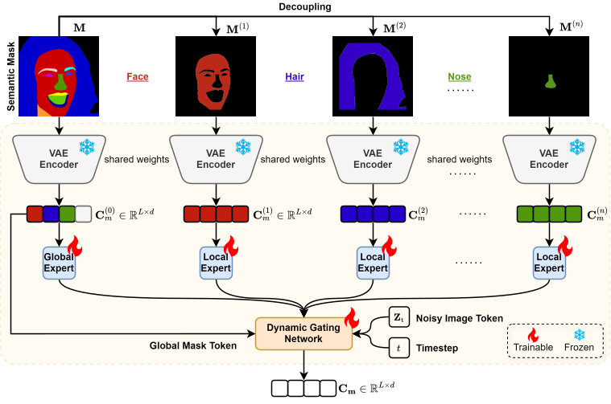
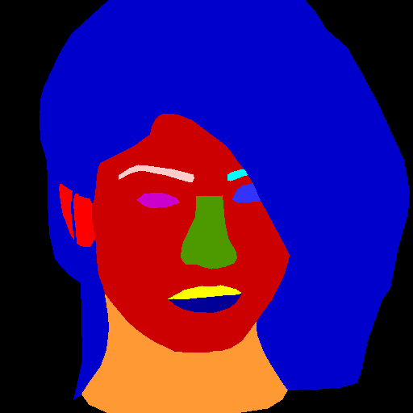
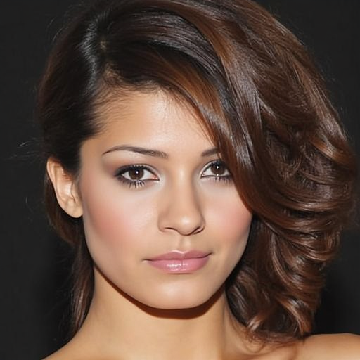
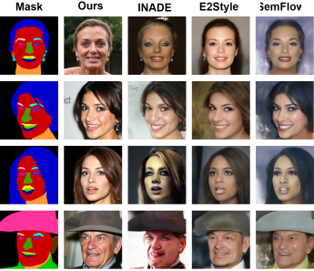
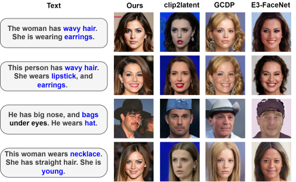
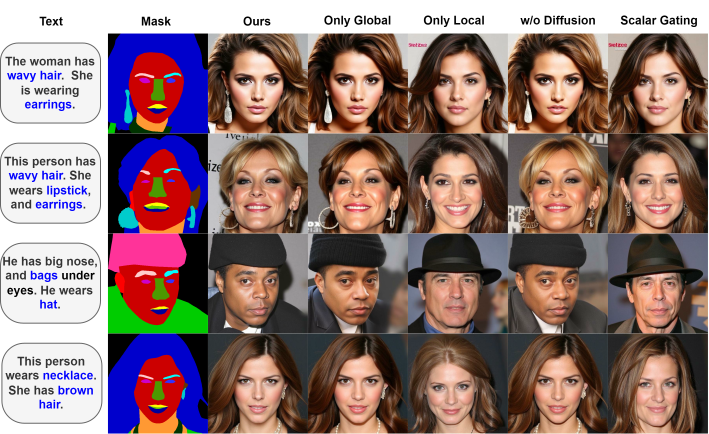
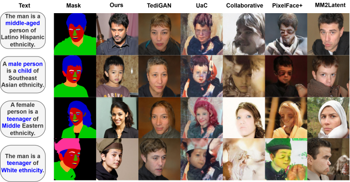

<div align="center">


# [TPAMI 2026] Face-MoGLE

Mixture of Global and Local Experts with Diffusion Transformer for Controllable Face Generation

[](https://ieeexplore.ieee.org/abstract/document/11592693/)
[](https://doi.org/10.1109/TPAMI.2026.3708691)
[](https://arxiv.org/abs/2509.00428)
[](https://xavierjiezou.github.io/Face-MoGLE/)
<br>
[](https://huggingface.co/XavierJiezou/face-mogle-models)
[](https://huggingface.co/datasets/XavierJiezou/face-mogle-datasets)
[](https://huggingface.co/papers/2509.00428)
<!--[](https://huggingface.co/spaces/XavierJiezou/face-mogle)-->



</div>

## ⚙️ Installation

```bash
conda create -n face-mogle python=3.11.11
conda activate face-mogle
pip install -r requirements.txt
```

## 🏋️ Pretrained Weights

### Download Checkpoints

Before running the inference, test and gradio demo, please download the following files:

- **Pretrain**: [FLUX.1-dev](https://huggingface.co/black-forest-labs/FLUX.1-dev) (DiT-based)

- **SFT**: [pytorch_lora_weights.safetensors](https://huggingface.co/XavierJiezou/face-mogle-models/resolve/main/pytorch_lora_weights.safetensors) (LoRA) & [global_local_mask_moe.pt](https://huggingface.co/XavierJiezou/face-mogle-models/resolve/main/global_local_mask_moe.pt) (MoGLE)  

### Directory Setup

After downloading, please place the files in the following structure:

```bash
Face-MoGLE
├── ...
├── checkpoints
│   ├── FLUX.1-dev
├── runs
│   ├── face-mogle
│   │   ├── pytorch_lora_weights.safetensors
│   │   ├── global_local_mask_moe.pt
│   │   ├── config.yaml
````

## 🖼️ Inference

- Text-to-Face Generation

```bash
python inference.py --prompt "She is wearing lipstick. She is attractive and has straight hair."
```

- Mask-to-Face Generation	

```bash
python inference.py --mask "assets/readme_demo/27000.png"
```

- (Text+Mask)-to-Face Generation

```bash
python inference.py \
    --prompt "She is wearing lipstick. She is attractive and has straight hair." \
    --mask "assets/readme_demo/27000.png"
```

| Text Prompt                                                         | Senmentic Mask                          | Generated Face                                       |
| :-----------------------------------------------------------------: | :-------------------------------------: | :--------------------------------------------------: |
| “She is wearing lipstick. She is attractive and has straight hair.” | ∅                                       |             |
| ∅                                                                   |  |             |
| “She is wearing lipstick. She is attractive and has straight hair.” |  |  |

## 🌐 Gradio Demo (Web UI)

```bash
CUDA_VISIBLE_DEVICES=0 python gradio_app.py
````

<video src="https://github.com/user-attachments/assets/fa2ba2e0-03d5-4d61-887c-53cdce0ccdf7" controls width="100%" playsinline preload="metadata"></video>

## 📦 Prepare Data


### Download Datasets

You can download the datasets from Hugging Face:

| Dataset Name            | Download Link                                                                                                                | Usage                               |
|:------------------:|:-----------------------------------------------------------------------------------------------------------------------------:|:-----------------------------------:|
| **MM-CelebA-HQ**   | [Hugging Face](https://huggingface.co/datasets/XavierJiezou/face-mogle-datasets/resolve/main/mmcelebahq.zip) <br> (Also available in [TediGAN](https://github.com/IIGROUP/MM-CelebA-HQ-Dataset)) | Training & Evaluation                |
| **MM-FairFace-HQ** | [Hugging Face](https://huggingface.co/datasets/XavierJiezou/face-mogle-datasets/resolve/main/mmfairfacehq.zip)                    | Just for Zero-shot Generalization Validation |
| **MM-FFHQ-Female** | [Hugging Face](https://huggingface.co/datasets/XavierJiezou/face-mogle-datasets/resolve/main/mmffhqfemale.zip)                    | Just for Zero-shot Generalization Validation |

**Note:**  
> The **MM-FairFace-HQ** and **MM-FFHQ-Female** datasets are multimodal extensions we constructed based on the original face image datasets, using a semi-automated annotation approach.

### Dataset Structure

After extraction, please organize the directory as follows:

```bash
Face-MoGLE
├── ...
├── data
│   ├── mmcelebahq
│   │   ├── face
│   │   │   ├── 0.jpg
│   │   │   ├── 1.jpg
│   │   ├── mask
│   │   │   ├── 0.png
│   │   │   ├── 1.png
│   │   ├── text
│   │   │   ├── 0.txt
│   │   │   ├── 1.txt
│   │   ├── text.json
│   ├── mmffhqfemale
│   │   ├── face
│   │   │   ├── 00001.jpg
│   │   │   ├── 00002.jpg
│   │   ├── mask
│   │   │   ├── 00001.png
│   │   │   ├── 00002.png
│   │   ├── text
│   │   │   ├── 00001.txt
│   │   │   ├── 00002.txt
│   │   ├── text.json
│   ├── mmfairfacehq
│   │   ├── face
│   │   │   ├── 52.jpg
│   │   │   ├── 55.jpg
│   │   ├── mask
│   │   │   ├── 52.png
│   │   │   ├── 55.png
│   │   ├── text
│   │   │   ├── 52.txt
│   │   │   ├── 55.txt
```

## 🚀 Training

```bash
bash script/train_face-mogle.sh
```

## 🧪 Testing

```bash
python test.py \
  --root data/mmcelebahq \
  --lora_ckpt runs/face-mogle/pytorch_lora_weights.safetensors \
  --moe_ckpt runs/face-mogle/global_local_mask_moe.pt \
  --pretrained_ckpt checkpoints/FLUX.1-dev \
  --config_path runs/face-mogle/config.yaml \
  --output_dir visualization/face-mogle
```

## 📊 Evaluation

Face-MoGLE is evaluated across multiple dimensions, including：
- **Generation Quality**： FID & KID & CMMD
- **Condition Alignment**: Text Consistency & Mask Consistency
- **Human Preference**: IR

---

### FID / KID / Text Consistency

> FID & KID: https://github.com/GaParmar/clean-fid

> Text Consistency: https://github.com/Taited/clip-score

```bash
python src/eval/eval_fid_kid_text.py \
    --fake_image visulization/face-mogle/face \
    --real_face_dir visulization/mmcelebahq/face \
    --real_text_dir visulization/mmcelebahq/text
```

### CMMD (CLIP Maximum Mean Discrepancy)  

> CMMD: https://github.com/sayakpaul/cmmd-pytorch

```bash
cd src/eval/eval_cmmd & python eval_cmmd.py <gt_dir> <pred_dir>
```

### Mask Consistency (DINO Structure Distance)  

> Mask Consistency: https://github.com/omerbt/Splice

```bash
python src/eval/eval_mask.py \
    --real_dir visulization/mmcelebahq/face \
    --fake_img visulization/face-mogle/face
```

### IR (ImageReward)  

> IR: https://github.com/THUDM/ImageReward

```bash
python src/eval/eval_ir.py \
    --image_path visulization/face-mogle/face \
    --text_path visulization/mmcelebahq/text
```

## 👀 Visualization

> More visualization results are available at [Hugging Face](https://huggingface.co/datasets/XavierJiezou/face-mogle-datasets/tree/main/visualization), which can be used for comparison in your paper. Please kindly cite our work if you find it useful.

### Monomodal Generation

<table>
  <tr>
    <td align="center"><b>Mask-to-Face Generation</b></td>
    <td align="center"><b>Text-to-Face Generation</b></td>
  </tr>
  <tr>
    <td></td>
    <td></td>
  </tr>
</table>

### Multimodal Generation

<p align="center">
  
</p>

### Ablation Study

<p align="center">
  
</p>

### Zero-Shot Generalization

- MM-FFHQ-Female

<p align="center">
  
</p>

- MM-FairFace-HQ


<p align="center">
  
</p>


## 📚 Citation

```bibtex
@ARTICLE{face-mogle,
  author={Zou, Xuechao and Zhang, Shun and Fu, Xing and Li, Yue and Li, Kai and Cao, Yushe and Lang, Congyan and Tao, Pin and Xing, Junliang},
  journal={IEEE Transactions on Pattern Analysis and Machine Intelligence}, 
  title={Mixture of Global and Local Experts with Diffusion Transformer for Controllable Face Generation}, 
  year={2026},
  volume={},
  number={},
  pages={1-17},
  keywords={Faces;Modeling;Noise reduction;Educational institutions;Computers;Diffusion models;Training;Transformers;Technology;Generative adversarial networks;Mixture of Experts;Diffusion Transformer;Controllable Face Generation;Multimodal Conditioning},
  doi={10.1109/TPAMI.2026.3708691}
}
```

## 📜 License

This project is licensed under the Apache License 2.0 License. See the [LICENSE](LICENSE) file for details.
